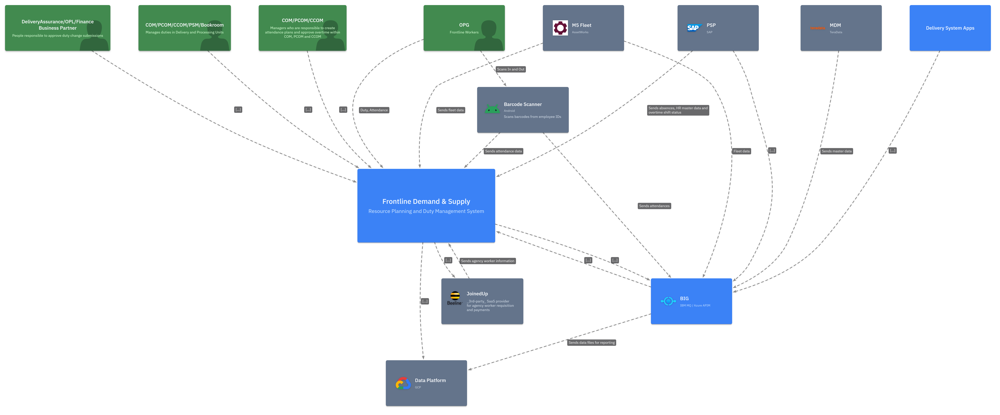

== Context and Scope

*Contents*

_Context and scope - as the name suggests - delimits your system (i.e.
your scope) from all its communication partners (neighboring systems and
users, i.e. the context of your system). It thereby specifies the
external interfaces._

_If necessary, differentiate the business context (domain specific inputs
and outputs) from the technical context (channels, protocols, hardware)._

*Motivation*

_The domain interfaces and technical interfaces to communication partners
are among your system’s most critical aspects. Make sure that you
completely understand them._

*Form*

_Various options:_

* Context diagrams
* Lists of communication partners and their interfaces.

=== Business Context

*Contents*

_Specification of *all* communication partners (users, IT-systems, …​)
with explanations of domain specific inputs and outputs or interfaces.
Optionally you can add domain specific formats or communication
protocols._

_We need to put context diagram from C4 model but more oriented around
interaction between business capability provide by the current system
and other organizational business capabilities_

*Motivation*

_All stakeholders should understand which data are exchanged with the
environment of the system._

*Form*

_All kinds of diagrams that show the system as a black box and specify
the domain interfaces to communication partners._

_Alternatively (or additionally) you can use a table. The title of the
table is the name of your system, the three columns contain the name of
the communication partner, the inputs, and the outputs._

*++<++Diagram or Table++>++*

*++<++optionally: Explanation of external domain interfaces++>++*

*Royal Mail [Enter Solution/Application Acronym here, e.g PDA] - Processing Sites: Worked Example*

*[Enter Solution/Application Acronym here, e.g PDA] Processing Sites - Business Context:*

[width="100%",cols="30%,30%,40%",options="header",]
|===
|*Communication Partner* |*Inputs to [Enter Solution/Application Acronym here, e.g PDA]* |*Outputs from [Enter Solution/Application Acronym here, e.g PDA]*
|MDS (Master Duty System) |Master duty data, work-area splits, rotation patterns, processing-site reference data, OT duties, employee assignments to duties. |Headcount report and other operational reports back to MDS.
|PSM (Processing Site Manager) |Duty-holder allocation, daily attendance plan adjustments, OT shift creation, employee site loans, OT and SA approvals. |Daily attendance plan, work-area split view, OT plan, four-week past/future planning view.
|WAM (Work Area Manager) |Local read; print requests for shift output. |Employee Line View and Work Area Line View, hours-by-employee and hours-by-area, printable splits.
|Production Scheduler |Report parameter requests (site, date range). |10-minute-granularity headcount-by-work-area report; total hours by shift and by day.
|Site Manager / Book-room |Offline-validated OT confirmations; review actions. |OT approval queue, scan-vs-plan reconciliation.
|PDA and Console |Employee scan-on / scan-off events with timestamp and location. |one-way ingest
|RMG HR System (Employee Payrolls) |bi-directional |Authorised OT and Schedule-Attendance records for payroll processing.
|Agency Payroll System |API acknowledgements; rejection reasons. |Approved agency timesheets via API.
|Reporting and Visualisation |One-way egress |Attendance plan, OT, compliance and RCS data feeds.
|User Identities |User identity and group membership. |Authentication assertions via SSO redirect.
|===

==== Business Context - Diagram

_A C4-style System Context diagram should be inserted here in production usage._

_#++<++placeholder++>++#_

=== Technical Context

*Contents*

_Technical interfaces (channels and transmission media) linking your
system to its environment. In addition a mapping of domain specific
input/output to the channels, i.e. an explanation which I/O uses which
channel._

_We need to put context diagram from C4 model but more oriented around
interaction between the current system and other RMG systems and
external systems._

IMPORTANT: We must ALSO include [red]*Big Picture* here

.Big Picture
image::../images/[Enter Solution/Application Acronym here, e.g PDA] - Big Picture.png[Big Picture]

*Motivation*

_Many stakeholders make architectural decision based on the technical
interfaces between the system and its context. Especially infrastructure
or hardware designers decide these technical interfaces._

*Form*

_E.g. UML deployment diagram describing channels to neighboring systems,
together with a mapping table showing the relationships between channels
and input/output._

*++<++Diagram or Table++>++*

*++<++Optionally: Explanation of technical interfaces++>++*

*++<++Mapping Input/Output to Channels++>++*

IMPORTANT: Conceptual diagram is replaced with business and technical context
diagrams. We will use Context diagrams from C4 model here.

*Further Information*

_See_ https://docs.arc42.org/section-3/[Context and Scope] _in the arc42
documentation._

*Royal Mail [Enter Solution/Application Acronym here, e.g PDA] - Processing Sites: Worked Example*

[width="99%",cols="20%,25%,25%,30%",options="header",]
|===
|*Partner* |*Channel* |*Protocol / Format* |*Direction & Cadence*
|MDS |Direct – Sharepoint |FTPS |Inbound: monthly bulk {plus} on-demand delta. Outbound: scheduled report.
|PSP |MQ |AQMP - XML |Outbound: per approval event, near-real-time.
|JoinedUp |API Gateway → JoinedUp public API |REST/JSON over HTTPS |Outbound: per approved agency timesheet.
|PDA estate |IBM MQ |AQMP - JSON |Inbound: continuous stream.
|Console |IBM MQ |AQMP - JSON |Inbound: continuous stream.
|DP / Qlik |BIG MFT |FTPS - CSV |Outbound: T{plus}1 data sets.
|Active Directory / SSO |Identity provider (Entra ID) |SAML |Inbound: per-user auth.
|===

==== Technical Context - Diagram

.Technical Context
