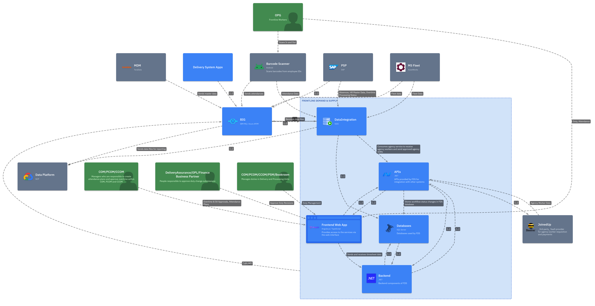
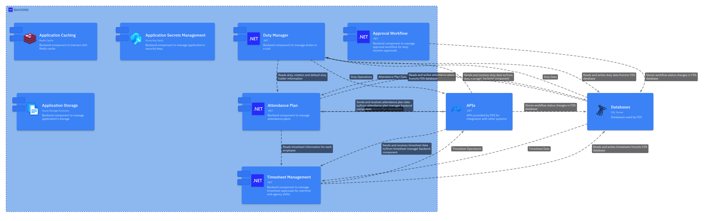
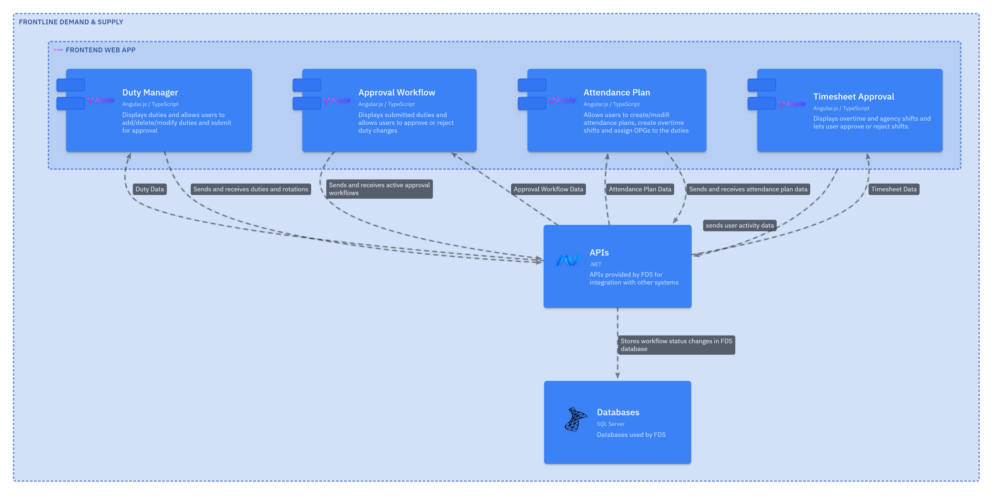

== Building Block View

*Content*

_The building block view shows the static decomposition of the system
into building blocks (modules, components, subsystems, classes,
interfaces, packages, libraries, frameworks, layers, partitions, tiers,
functions, macros, operations, data structures, …​) as well as their
dependencies (relationships, associations, …​)_

IMPORTANT: This view is mandatory for every architecture documentation. In analogy
to a house this is the [red]*Floor Plan*.

_Since it contains static view of the system, we need to put container
and component diagrams (C2 & C3) from C4 model. It only shows the
relationships between various containers, components and external
systems (Both internal & external to RMG)_

_This section should also contain Integration Architecture (Reference to
ICDs etc.)_

*Motivation*

_Maintain an overview of your source code by making its structure
understandable through abstraction._

_This allows you to communicate with your stakeholder on an abstract
level without disclosing implementation details._

*Further Information*

_See_ https://docs.arc42.org/section-5/[Building Block View] _in the arc42 documentation._

*Royal Mail FDS - Processing Sites: Worked Example*

=== Container Diagram

.Container Diagram

=== Component Diagram (Backend Components)

.Component Diagram (Backend Component)

.Component Diagram (Frontend Component)
