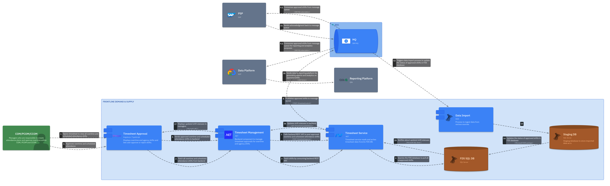
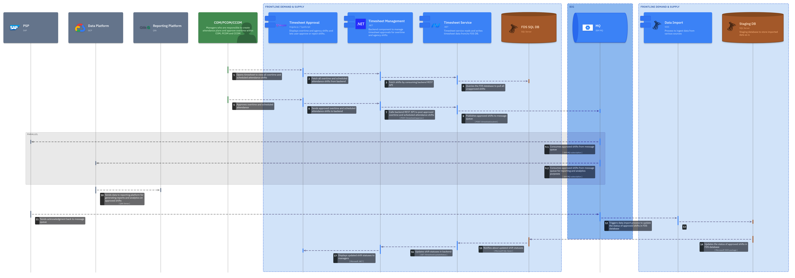

== Runtime View

*Contents*

_The runtime view describes concrete behavior and interactions of the
system’s building blocks in form of scenarios from the following areas:_

* important use cases or features: how do building blocks execute them?
* interactions at critical external interfaces: how do building blocks
cooperate with users and neighboring systems?
* operation and administration: launch, start-up, stop
* error and exception scenarios

TIP: The main criterion for the choice of possible scenarios
(sequences, workflows) is their *architectural relevance*. It is *not*
important to describe a large number of scenarios. You should rather
document a representative selection.

*Motivation*

_You should understand how (instances of) building blocks of your system
perform their job and communicate at runtime. You will mainly capture
scenarios in your documentation to communicate your architecture to
stakeholders that are less willing or able to read and understand the
static models (building block view, deployment view)._

*Form*

_Following diagrams could be part of this section:_

* *System Landscape Diagram (C4 Model)*

* *Activity Diagrams and Sequence Diagrams for some of the key Use Cases*

*Further Information*

_See_ https://docs.arc42.org/section-6/[Runtime View] _in the arc42
documentation._

*Royal Mail [Enter Solution/Application Acronym here, e.g PDA] - Processing Sites: Worked Example*

=== Use Case 01 – Approve Overtime 

Trigger: Manager Approve action on the [Enter Solution/Application Acronym here, e.g PDA] Over time timesheet screen

. Delivery Office Manager (COM) opens the Timesheet Screen
. Frontend → Backend → Timesheet Service API → [Enter Solution/Application Acronym here, e.g PDA] DB (fetch unapproved shifts)
. Manager approves shifts
. Timesheet Service publishes to IBM MQ topic "approved-shifts"
. Parallel consumption: PSP (SAP) {plus} Data Platform both subscribe from MQ
. Data Platform → Reporting (Qlik)
. PSP sends acknowledgment → MQ → triggers Data Import (SSIS) to update shift status
. Status flows back up: [Enter Solution/Application Acronym here, e.g PDA]DB → API → Backend → Frontend (manager sees updated status)

==== Activity Diagram – Approve Overtime 

.Activity Diagram – Approve Overtime

==== Sequence Diagram – Approve Overtime

.Sequence Diagram – Approve Overtime
